# Constraining the richness–mass relation from imperfect mass estimates

## Setup

We have per-cluster mass posteriors $p(m\mid x)$ from some mass model (in these tests,
*Graph-Net* / `gnn_npe`, run on the *Euclid* deep-100% mock), and we want to use
them to constrain the photometric-richness–mass relation. The difficulty is that
the mass estimates are noisy and, as we will see, biased in ways that are
correlated with richness.

To diagnose each likelihood we run it twice on the same clusters: once feeding it
the true masses (blue contours) and once feeding it the model's predicted masses
(red contours). If the likelihood is correctly specified, the two should agree to
within their statistical errors; where they disagree, the gap tells us which
assumption is being violated. We quantify the agreement with the Mahalanobis
distance $d$ between the two posteriors in $(\pi_0, F_m, G_z)$ ($d\lesssim1$ means
they overlap).

Notation, used consistently below: $m=\log_{10}M_{200c}$ is the true mass,
$\hat m$ the estimate, $\lambda\equiv\lambda_{\rm phot}$ the photometric richness,
and $\zeta\equiv\log_{10}\frac{1+z}{1+z_0}$ the redshift variable, with pivots
$m_0=13.78$ and $z_0=0.82$. The forward relation has intercept $\pi_0$, mass slope
$F_m$, redshift slope $G_z$, and intrinsic scatter $\sigma_\lambda$. Where a model
requires calibration, I reserve 10% of the clusters as a calibration set whose
true masses are known.

---

## 1. The original formulation — the inverse model

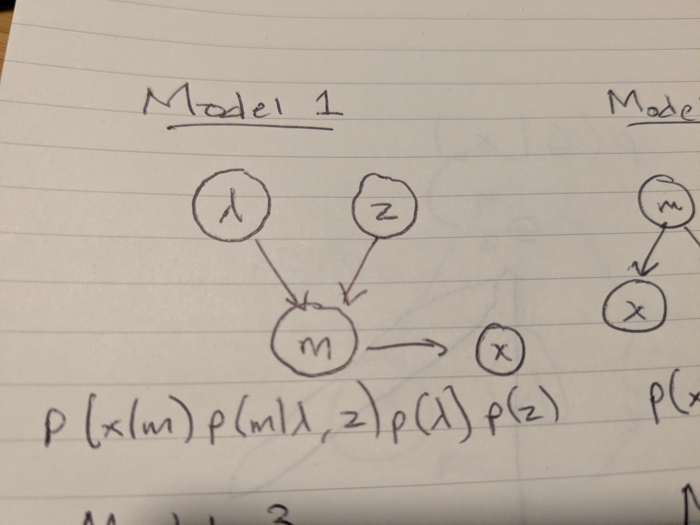

The most direct thing to write down is the distribution of mass given the
observables we actually have, $p(m\mid\lambda,z)$, taking the mean mass to be
linear in log-richness and in redshift. The mass estimate $\hat m$ is treated as a
noisy measurement of $m$.

Because this likelihood conditions on richness, each cluster's mass posterior was
itself produced under some inference prior $p(m)$, which I have to divide back out
before reweighting by the relation — otherwise the prior would be counted twice.

Likelihood

$$\langle m\mid\lambda,z\rangle = A + B\,\log_{10}\!\frac{\lambda}{\lambda_0} + C\,\zeta,\qquad m\mid\lambda,z\sim\mathcal N(\langle m\rangle,\ \sigma^2)$$

Marginalising each cluster's mass posterior samples $\{m_{is}\}$ and dividing out
the inference prior $p(m)=\mathcal N(m_0,\sigma_0^2)$:

$$\ln\mathcal L=\sum_i\ln\!\Big[\tfrac1S\sum_s\exp\big(\underbrace{\tfrac{(m_{is}-m_0)^2}{2\sigma_0^2}}_{\text{remove prior}}-\tfrac{(m_{is}-\langle m\mid\lambda_i,z_i\rangle)^2}{2\sigma^2}\big)\Big]$$

with parameters $\theta=\{A,\ B\,(=\!F_\lambda),\ C\,(=\!G_z),\ \sigma\}$.

| | $A$ | $B$ | $C$ |
|---|---|---|---|
| true | 13.83 | 1.27 | −2.95 |
| predicted | 13.88 | 1.63 | −3.08 |

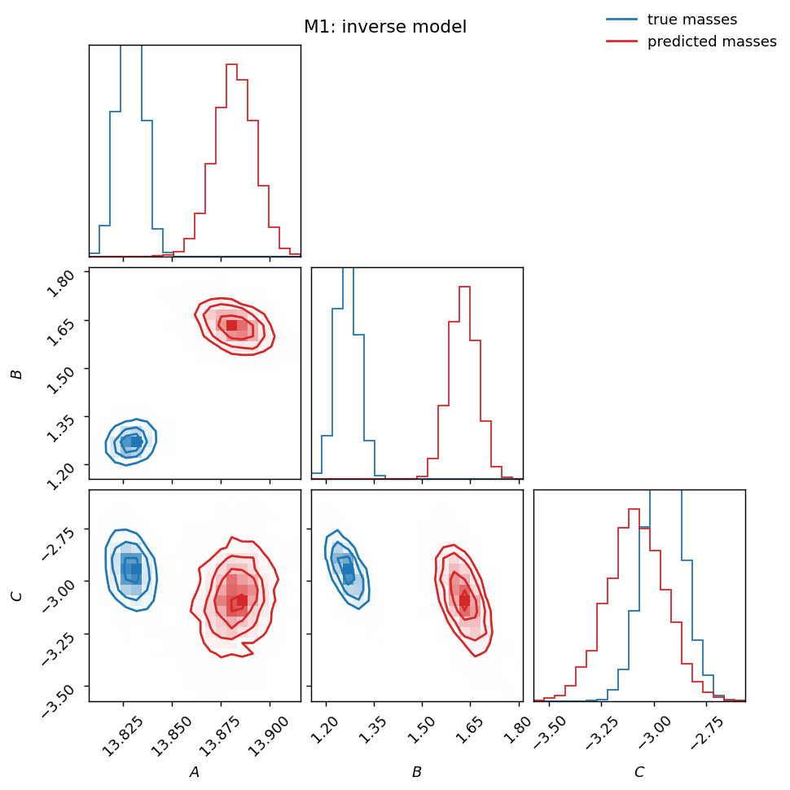
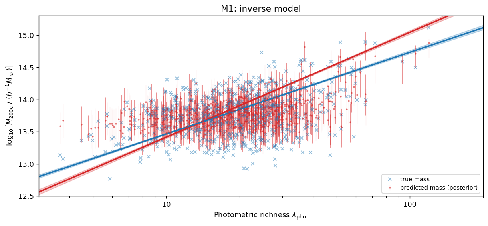

The predicted and true contours do not line up — the mass–richness slope $B$ is the
clearest offender. So the inverse parametrisation, fed my imperfect masses, does
not return the relation I would get from true masses. After a lot of tweaking, I couldn't figure out a way to make it work. I then looked throughout the literature on how to handle this. The more common choice is a forward model, which I tried next.

---

## 2. The forward model

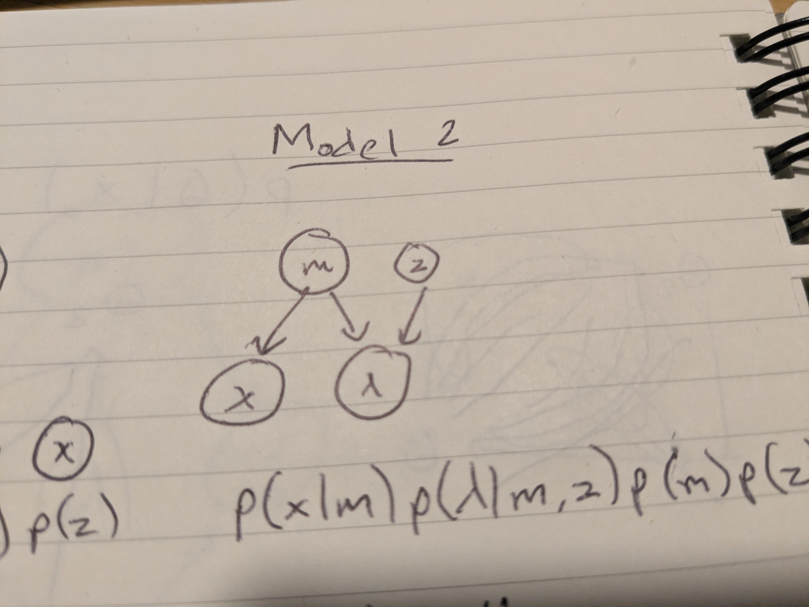

In the forward direction we instead model the distribution of the observable
richness given the mass, $p(\log_{10}\lambda\mid m,z)$. This is the standard choice
in cluster cosmology — modelling the conditional richness distribution as Gaussian
in log with an intrinsic scatter (e.g. [Murata et al. 2018](https://arxiv.org/abs/1707.01907); [Costanzi et al. 2019](https://arxiv.org/abs/1810.09456)).
The scatter I'm modelling is the physical scatter of richness at fixed mass, and the mass estimates enter only as something I marginalise over.

In this first version I assume the population of masses is described by the same
prior $p(m)$ used in the inference, in which case the prior ratio cancels and the
likelihood reduces to the richness residual alone.

Likelihood

$$\langle\log_{10}\lambda\mid m,z\rangle=\pi_0+F_m\,(m-m_0)+G_z\,\zeta,\qquad \log_{10}\lambda\mid m,z\sim\mathcal N(\langle\cdot\rangle,\ \sigma_\lambda^2)$$

With $\phi(m\mid z)=p(m)$ the mass-prior ratio cancels, leaving

$$\ln\mathcal L=\sum_i\ln\!\Big[\tfrac1S\sum_s\exp\!\big(-\tfrac{(\log_{10}\lambda_i-\langle\log_{10}\lambda\mid m_{is},z_i\rangle)^2}{2\sigma_\lambda^2}\big)\Big],\qquad \theta=\{\pi_0,F_m,G_z,\sigma_\lambda\}$$

| | $\pi_0$ | $F_m$ | $G_z$ |
|---|---|---|---|
| true | 1.25 | 0.334 | 2.07 |
| predicted | 1.25 | 0.464 | 1.90 |

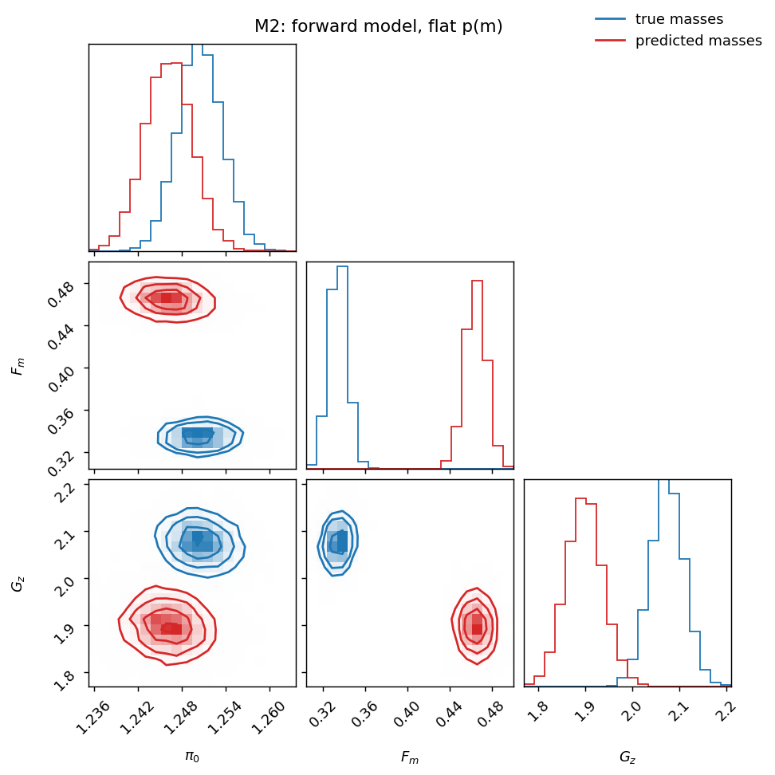
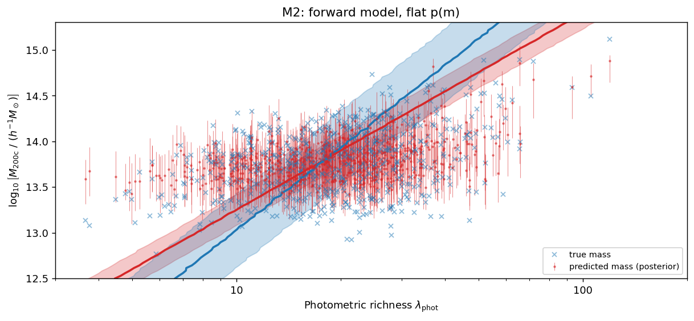

Here I hit a problem. I'd expected that using an uninformative mass
prior would simply inflate the error bars, since the masses carry less information.
Instead, the predicted-mass fit returns a redshift slope $G_z$ that is genuinely
offset from the true-mass value. 

The reason, once I dug into it, is that the mass
distribution itself depends on redshift — higher-$z$ clusters in the sample are
systematically more massive — so a prior that ignores this $p(m\mid z)$ dependence
pushes the inferred masses the wrong way as a function of $z$, and that error is
reabsorbed into the redshift slope of the richness relation. The trend is clear in
the data:

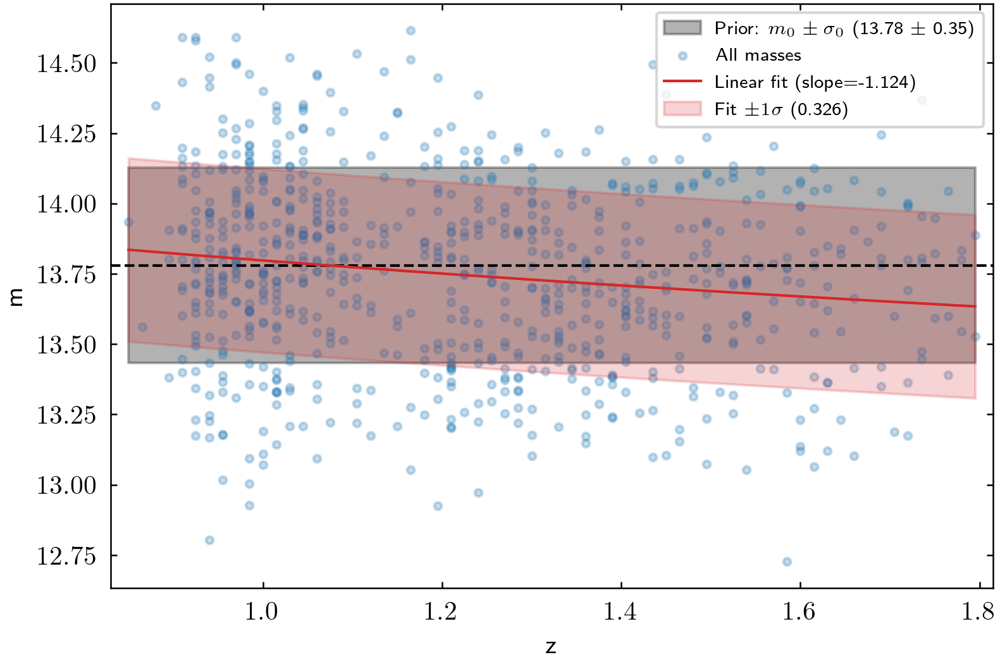

The photometric richness likewise rises with redshift (this is the physical effect
that the positive $G_z$ is meant to capture), so the two $z$-dependences are easy to
confuse if the mass prior is mis-specified:

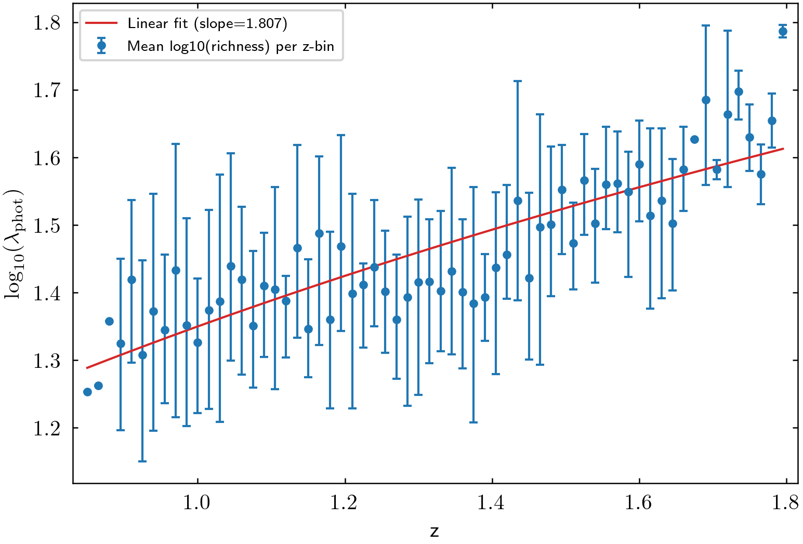

---

## 3. The forward model with $p(m\mid z)$

The fix this points to is to let the population prior on mass depend on redshift,
$\phi(m\mid z)$. In practice I reweight each mass sample by how much more (or less)
likely it is under the redshift-dependent population than under the flat inference
prior. The predicted contour here uses the gnn_npe mass posteriors (as in every
section); the only change from §2 is that the population prior is now
redshift-dependent.

Likelihood

Same forward relation, with each mass sample importance-reweighted by the
$z$-dependent population prior $\phi(m\mid z)=\mathcal N(m_\pi(z),\sigma_\pi^2)$
relative to the inference prior $p_{\rm inf}(m)=\mathcal N(m_0,\sigma_0^2)$:

$$\ln\mathcal L=\sum_i\ln\!\Big[\tfrac1S\sum_s\frac{\phi(m_{is}\mid z_i)}{p_{\rm inf}(m_{is})}\,\exp\!\big(-\tfrac{(\log_{10}\lambda_i-\langle\log_{10}\lambda\mid m_{is},z_i\rangle)^2}{2\sigma_\lambda^2}\big)\Big]$$

| | $\pi_0$ | $F_m$ | $G_z$ |
|---|---|---|---|
| true | 1.25 | 0.334 | 2.07 |
| predicted | 1.25 | 0.465 | 2.05 |

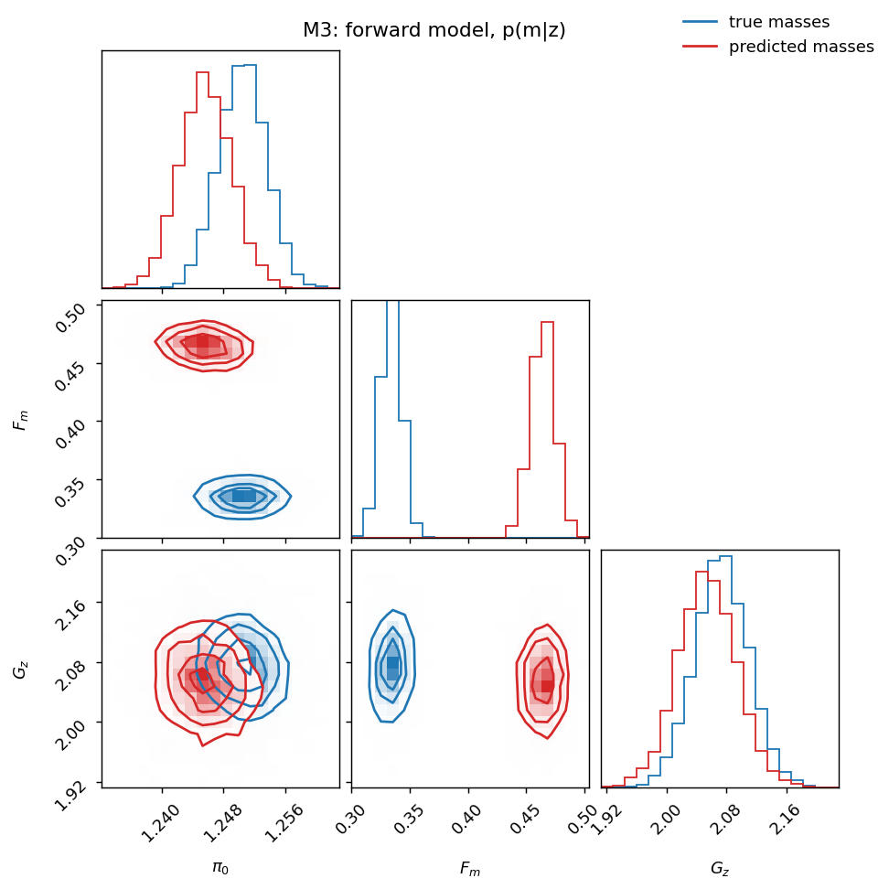

Modelling $p(m\mid z)$ brings the redshift slope $G_z$ back into agreement. The mass
slope $F_m$, though, is still biased. The problem that remains is that the residuals
on richness and on the predicted mass are not independent: my mass predictions are
imperfect and slightly biased, and that bias is correlated with richness. I model
this explicitly over the next two sections — first the mass bias, then the
correlation.

---

## 4. The forward model, calibrated with true masses

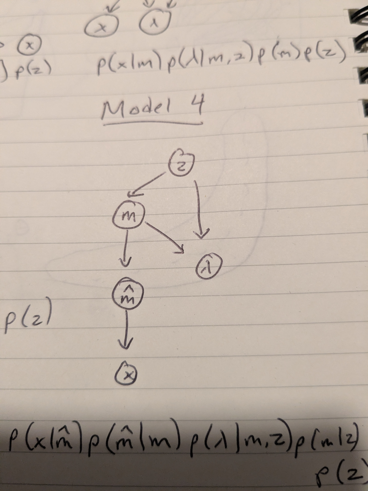

Next I treat the predicted mass $\hat m$ as a separate node: the true mass $m$
generates the estimate $\hat m$ through a calibration map (with its own offset,
slope, and scatter), and $m,z$ generate the richness. A small calibration subset,
for which I know the true masses, fixes the $m\!\to\!\hat m$ map and the estimate
scatter; I then marginalise over the latent mass for the rest of the sample. By
construction I never use the richness of the calibration clusters in the relation
term, so this calibration does not smuggle the answer in through the back door.

Likelihood

Latent mass $m\sim\phi(m\mid z)$; calibration map and forward relation
$$\hat m=a+b\,(m-m_0)+\eta_{\hat m},\qquad \log_{10}\lambda=\pi_0+F_m(m-m_0)+G_z\zeta+\eta_\lambda,$$
with residuals taken to be independent in this section,
$\eta_{\hat m}\sim\mathcal N(0,\omega^2)$, $\eta_\lambda\sim\mathcal N(0,\sigma_\lambda^2)$.

Calibration term (subset, true $m$ known): $\sum_{\rm cal}\ln\mathcal N(\hat m_i; a+b(m_i-m_0),\omega^2)$.

Relation term (main sample, latent $m$ grid-marginalised; the conditional form
divides out $p(\hat m_i)$ so the estimate is used as information, not as data
twice):
$$\sum_{\rm main}\ln\frac{\int \mathcal N(\log_{10}\lambda_i;\langle\cdot\rangle)\,\mathcal N(\hat m_i;a+b(m-m_0),\omega^2)\,\phi(m\mid z_i)\,dm}{\int \mathcal N(\hat m_i;a+b(m-m_0),\omega^2)\,\phi(m\mid z_i)\,dm}$$

| | $\pi_0$ | $F_m$ | $G_z$ | $d$ |
|---|---|---|---|---|
| true | 1.25 | 0.334 | 2.06 | |
| predicted | 1.25 | 0.492 | 2.11 | 10.3 |

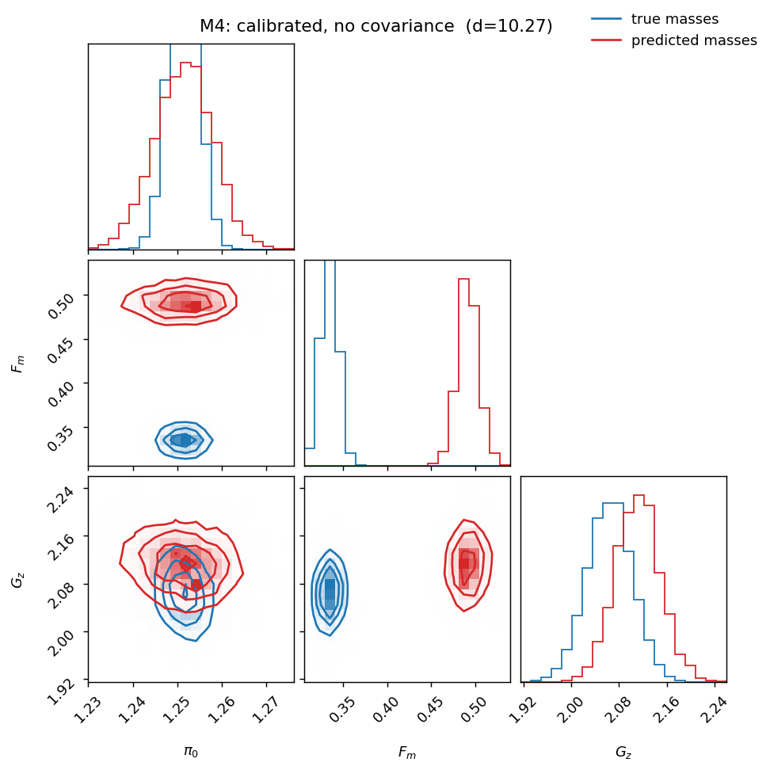
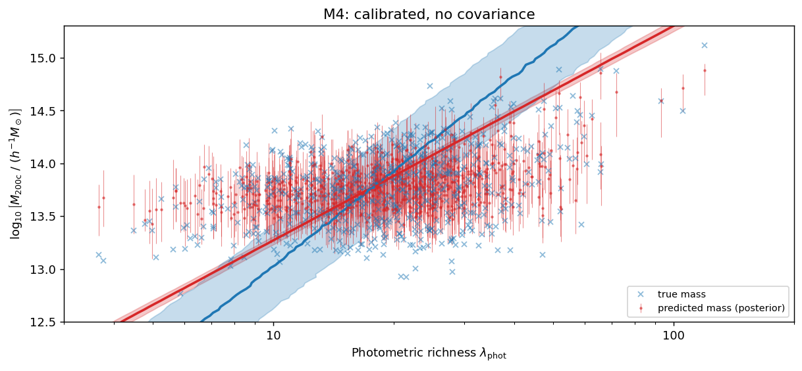

Calibrating the mass map removes the offset but leaves the slope $F_m$ biased. The
reason is that the model still assumes the estimate error $\eta_{\hat m}$ and the
richness scatter $\eta_\lambda$ are independent at fixed mass — and they are not.
This is a correlated-errors-in-variables situation: when the error in the variable
you regress on (here the inferred mass) is correlated with the error in the response
(richness), the recovered slope is biased, because part of the shared scatter looks
like a steeper relation. Physically I expect this correlation, since the mass
estimate uses the same galaxy information that sets the richness — directly as an
input (`gnn_npe`) or implicitly through the S/N cluster selection. When I check it,
the residual correlation is large and highly significant:

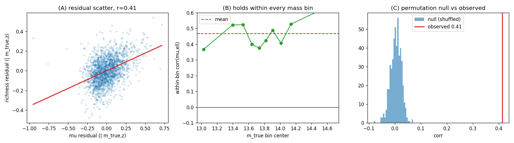

It is present within every narrow mass bin, so it is not an artefact of the overall
mass trend, and it sits about 20σ above a permutation null that shuffles the mass
residuals within each bin. This is the effect I model next.

---

## 5. The forward model, calibrated with true mass, with correlated residuals

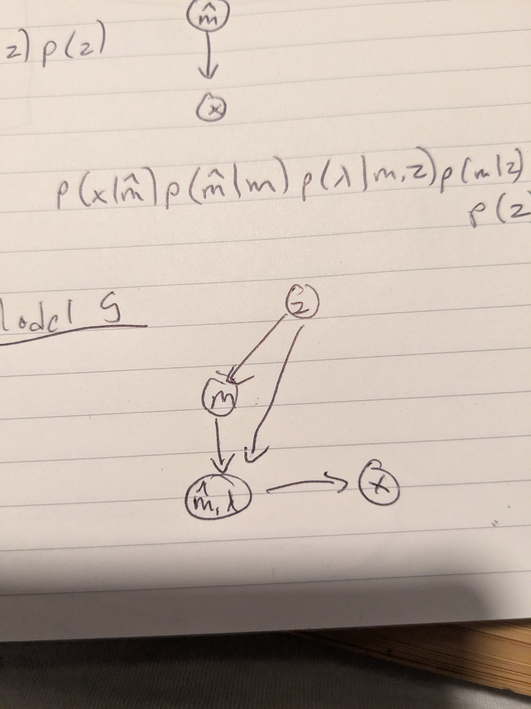

I keep everything from the previous section but now let the estimate residual and
the richness residual share a covariance at fixed true mass, with correlation
coefficient $\rho$. Intuitively, knowing that a cluster scattered high in its mass
estimate tells me it likely scattered high in richness too, and the model now
accounts for that instead of attributing it to the slope. Correlated scatter
between cluster observables at fixed mass is itself well documented (e.g. [Evrard et al. 2014](https://arxiv.org/abs/1403.1456)); here it is between the mass estimate and the
richness.

Likelihood (and the calibration of $\rho$)

$$\begin{pmatrix}\eta_{\hat m}\\ \eta_\lambda\end{pmatrix}\sim\mathcal N\!\left(\mathbf 0,\ \begin{pmatrix}\omega^2 & \rho\,\omega\sigma_\lambda\\ \rho\,\omega\sigma_\lambda & \sigma_\lambda^2\end{pmatrix}\right)$$

so the relation term uses the bivariate conditional
$$\log_{10}\lambda\mid\hat m,m\ \sim\ \mathcal N\big(\langle\log_{10}\lambda\rangle+\tfrac{\rho\sigma_\lambda}{\omega}(\hat m-a-b(m-m_0)),\ \sigma_\lambda^2(1-\rho^2)\big),$$
grid-marginalised over $m$ as before.

Calibrating $\rho$: the main sample on its own cannot separate $\rho$ from $F_m$
(they trade off along a degeneracy), so I measure $\rho$ on the calibration subset,
where the true masses are known, as the partial correlation of the mass and
richness residuals, and then hold it fixed while fitting $\{\pi_0,F_m,G_z,a,b,
\omega,\sigma_\lambda\}$ jointly. The calibration richness enters only this
covariance, never the relation amplitude (a throwaway nuisance relation absorbs the
calibration-subset mean).

| | $\pi_0$ | $F_m$ | $G_z$ | $d$ |
|---|---|---|---|---|
| true | 1.25 | 0.334 | 2.06 | |
| predicted | 1.25 | 0.310 | 2.03 | 1.04 |

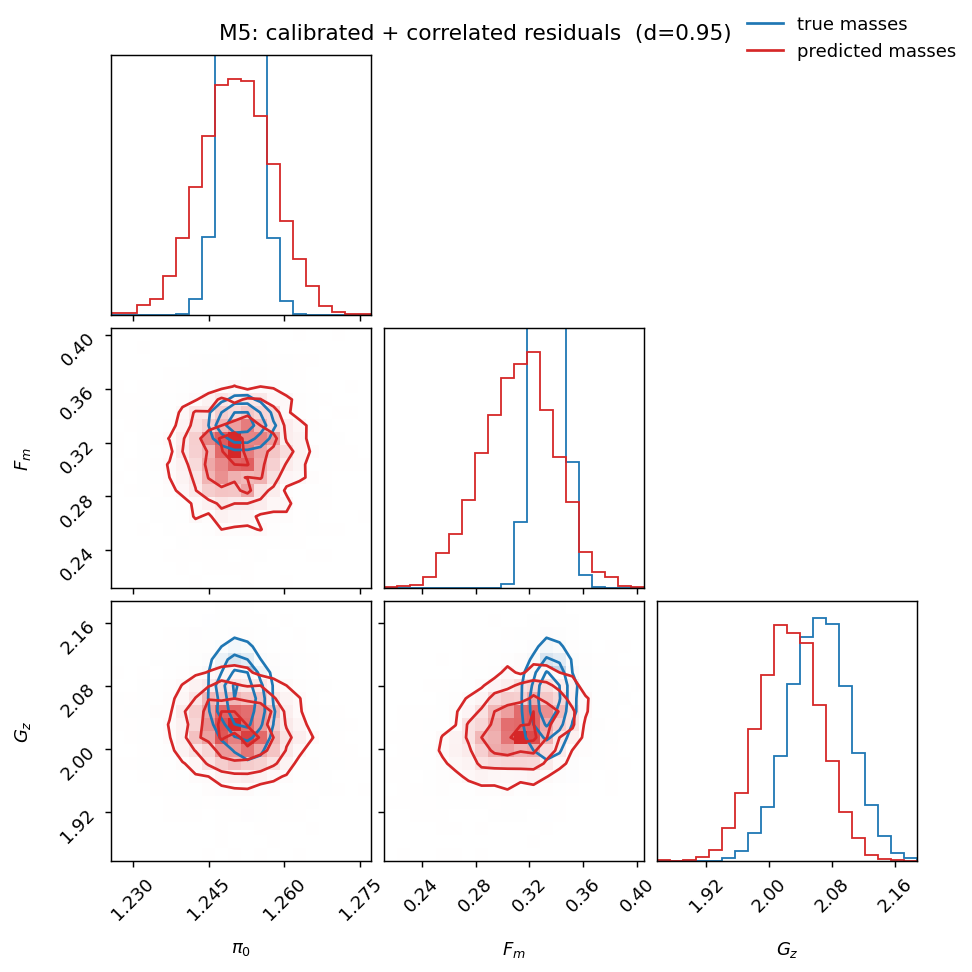
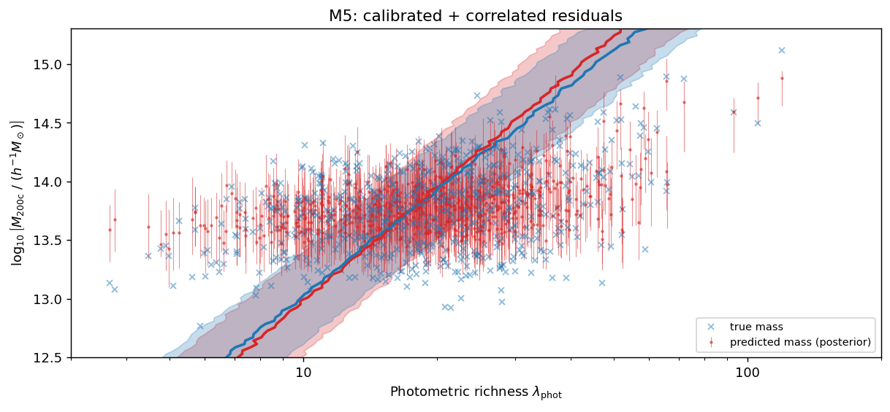

Once I include the correlated residuals, the predicted-mass and true-mass contours
finally come into agreement. This is the model I settled on.

---

## 6. The final relations

The size of the residual correlation $\rho$ is not the same for every mass
estimator. I find it is largest for the methods that read the galaxy content of a
cluster — Graph-Net and the neural likelihood-estimation summaries — which is
exactly the information that also sets the richness; it is close to zero for the
purely dynamical estimators, which measure mass through velocities and are not tied
to the galaxy counts:

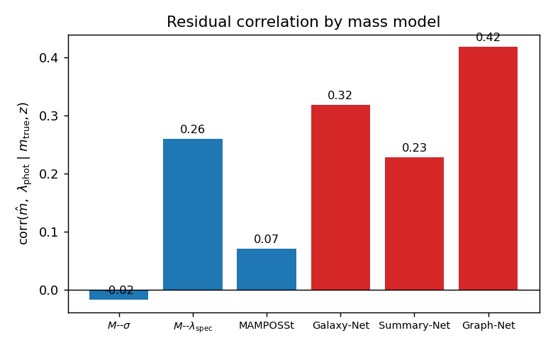

Fitting each estimator with the final correlated-residuals model (10% calibration)
gives:

| model | $F_m$ (pred / true) | $\rho$ | $d$ |
|---|---|---|---|
| $M$–$\sigma$ | 0.140 / 0.339 | −0.12 | 4.0 |
| $M$–$\lambda_{\rm spec}$ | 0.335 / 0.339 | 0.28 | 1.4 |
| MAMPOSSt | 0.360 / 0.340 | 0.23 | 5.8 |
| Galaxy-Net | 0.324 / 0.334 | 0.44 | 0.7 |
| Summary-Net | 0.315 / 0.333 | 0.36 | 1.0 |
| Graph-Net | 0.310 / 0.334 | 0.48 | 1.0 |

The estimators that carry substantial information about the true mass — Graph-Net,
Galaxy-Net, Summary-Net, and $M$–$\lambda_{\rm spec}$ — recover the true relation.
The two whose estimates correlate only weakly with the true mass, $M$–$\sigma$ and
MAMPOSSt, remain biased, because the calibration step has too little mass
information to work with.

Corner + scaling per model

| | corner | scaling |
|---|---|---|
| $M$–$\sigma$ | 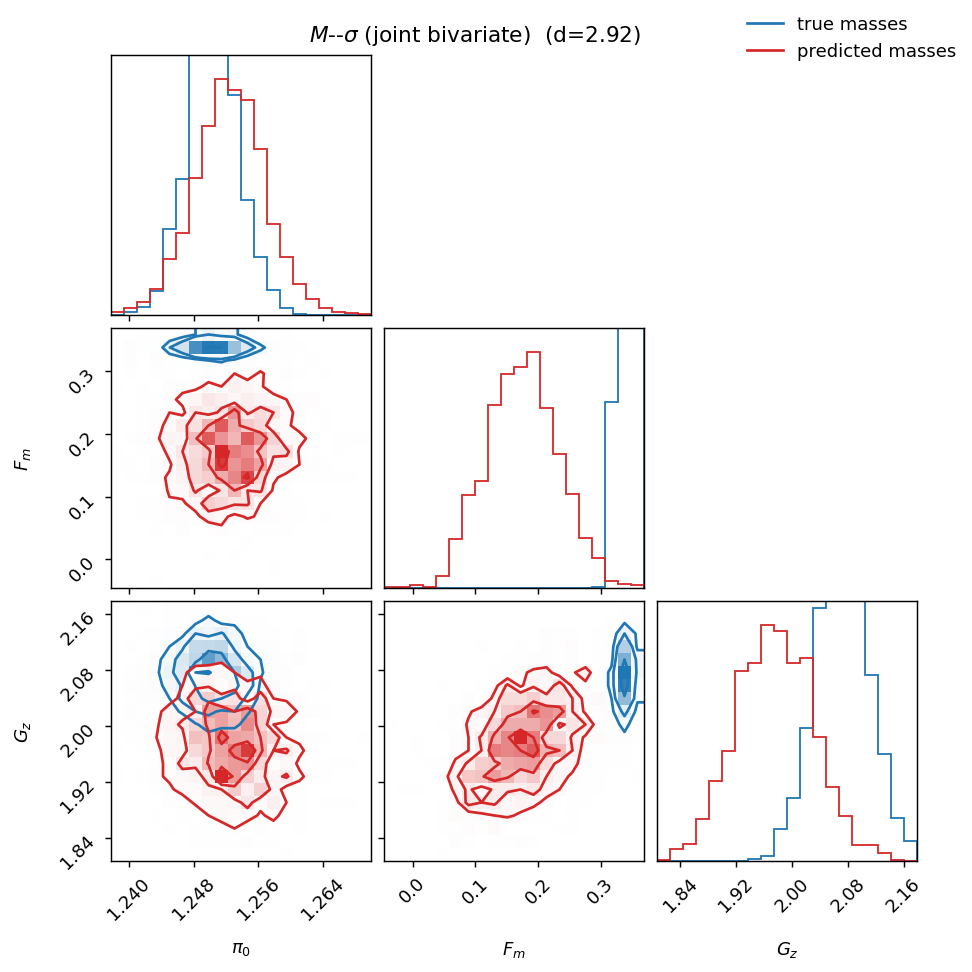 | 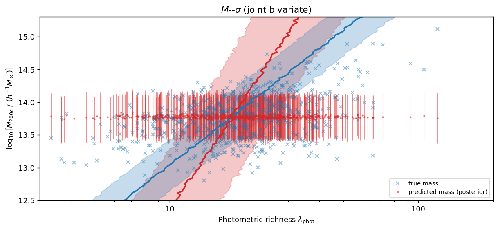 |
| $M$–$\lambda_{\rm spec}$ | 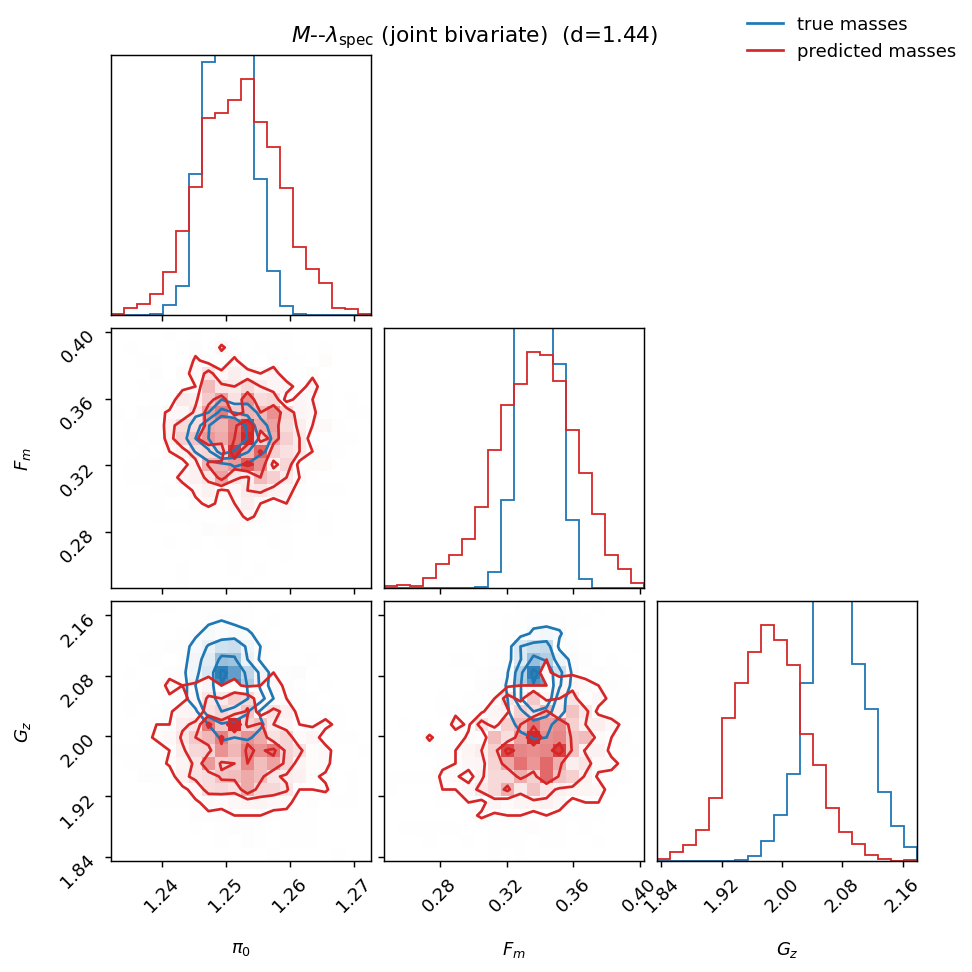 | 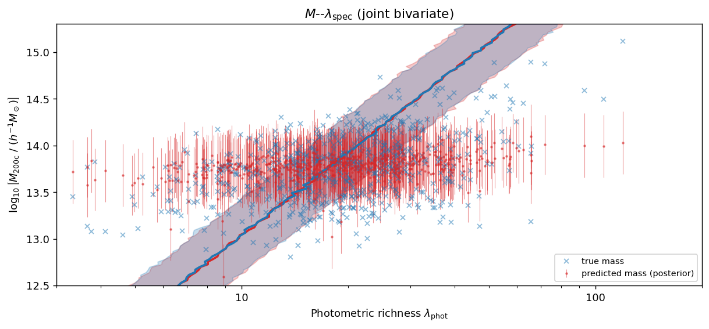 |
| MAMPOSSt | 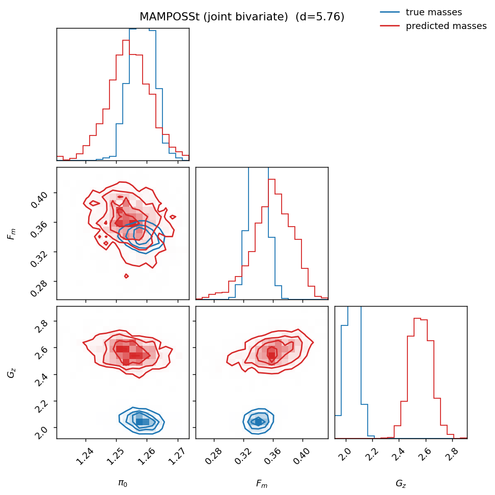 | 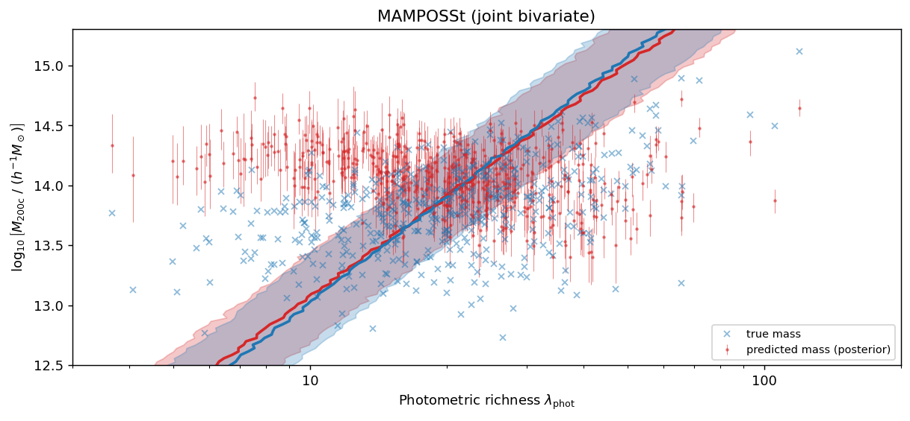 |
| Galaxy-Net | 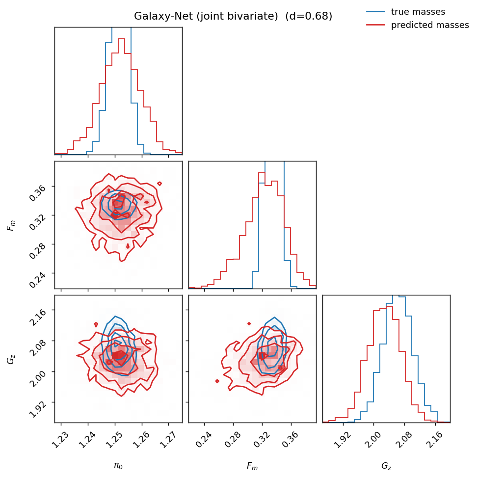 | 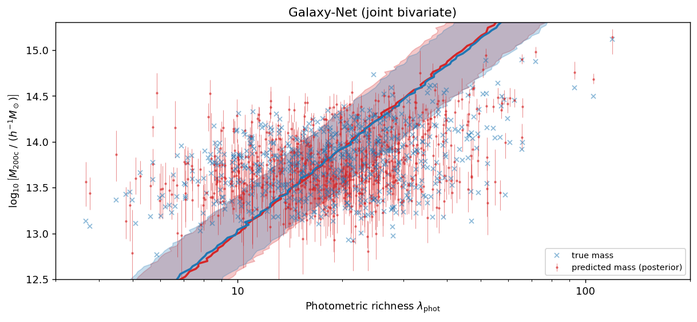 |
| Summary-Net | 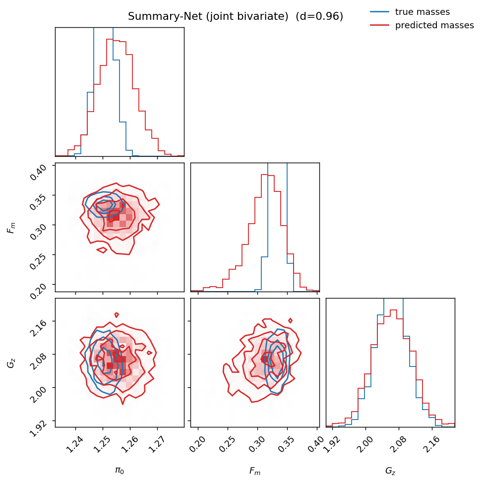 | 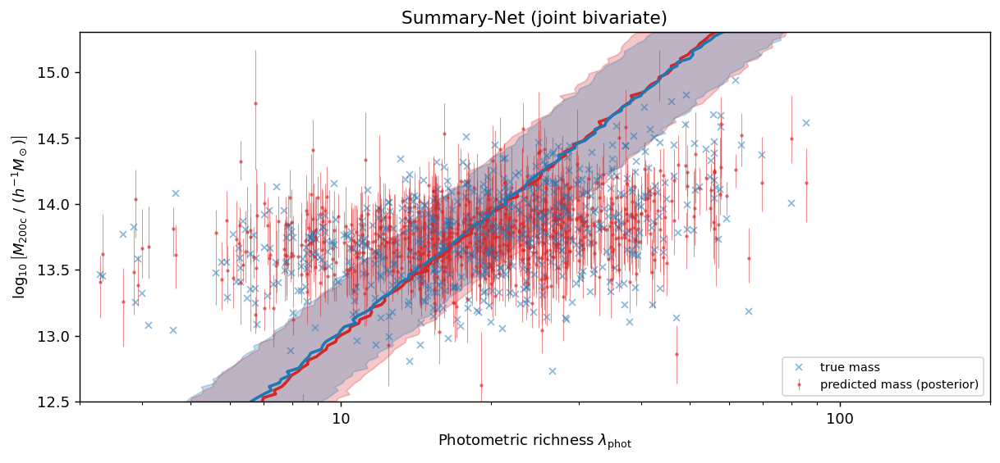 |
| Graph-Net | 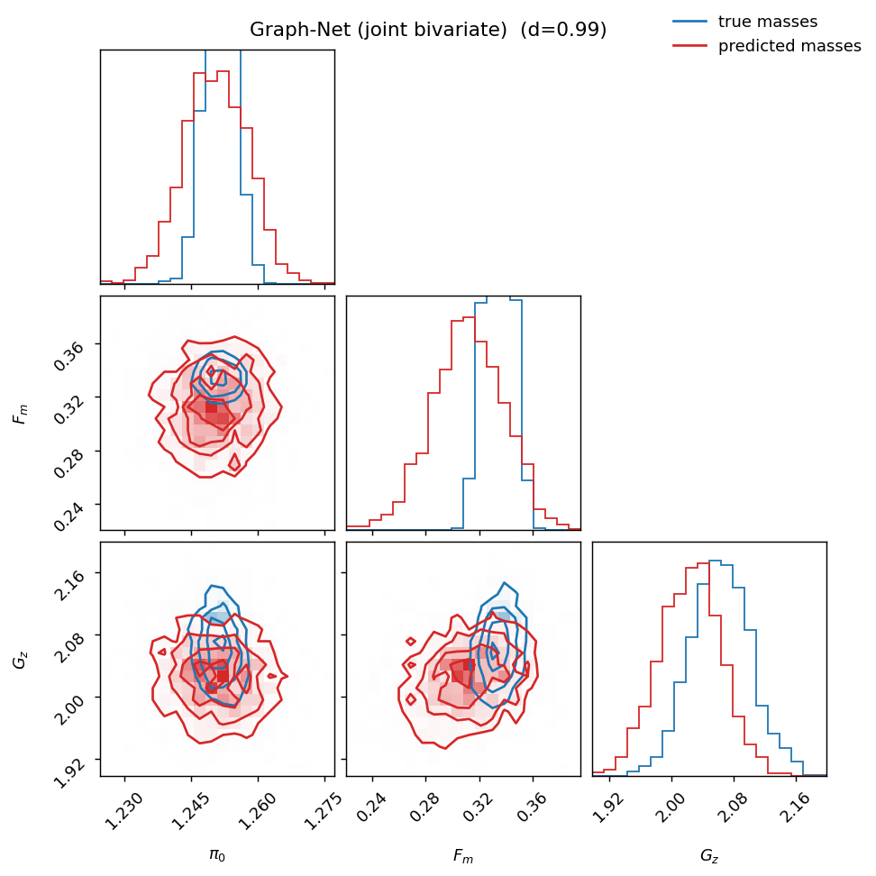 | 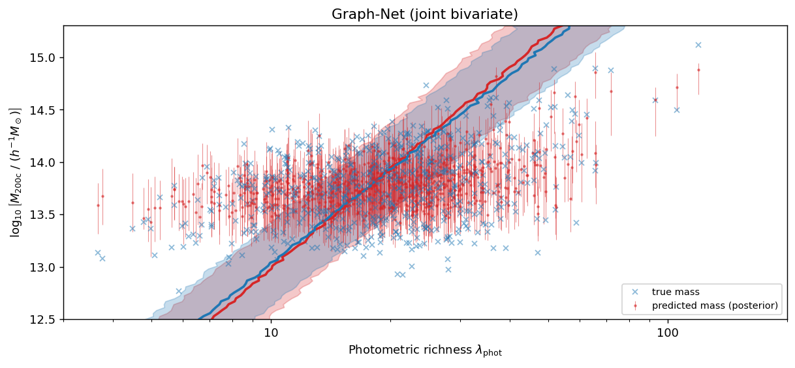 |

